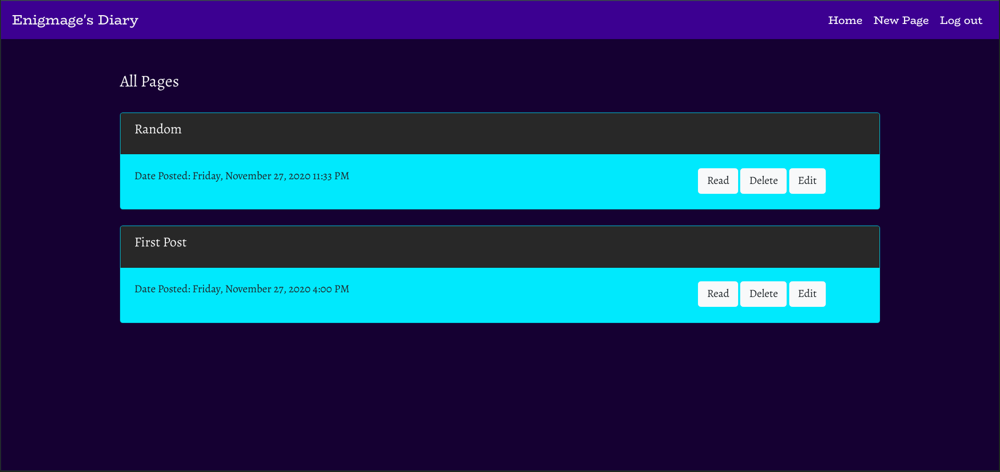
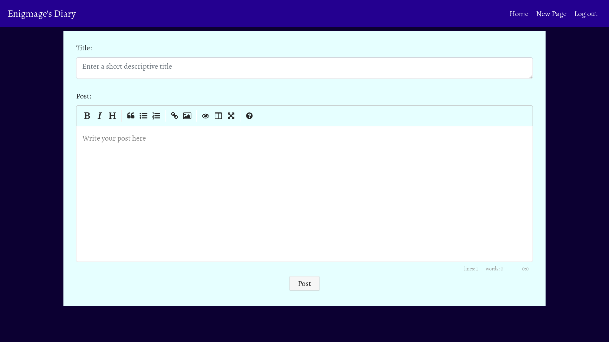
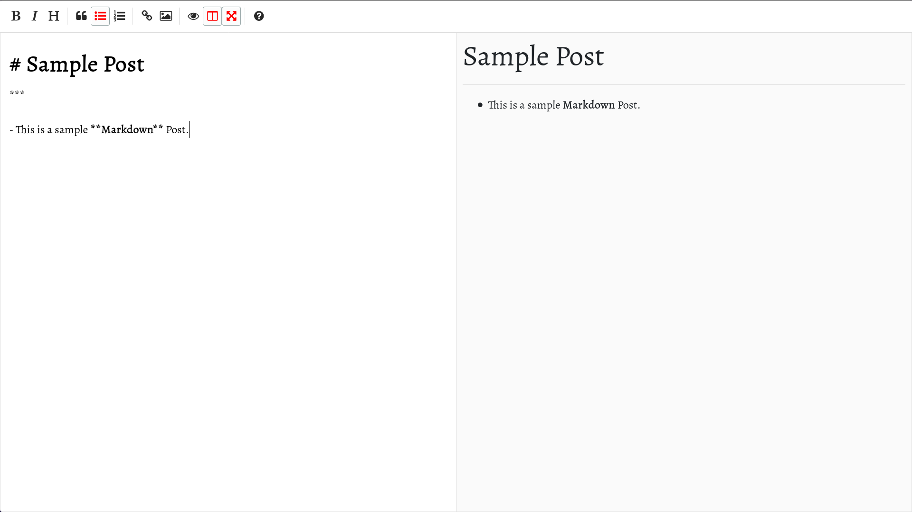

# Journyy

A Journal keeping web application written in Python (Flask) with complete CRUD functionality, using Postgresql as the databse, a fully functional authentication system, OAuth 2.0 login with google support, also features like password-reset using JWTs.

### Dashboard

- Simple Dashboard to keep all your journals in one place. Time of each post is displayed to help keep tracking. This application uses MomentJS to map UTC to localtime, so no matter if you are in a different timezone that the server, you will always be shown your appropriate local time.

### Editor

- Markdown editor for writing.

- Live preview Markdown

