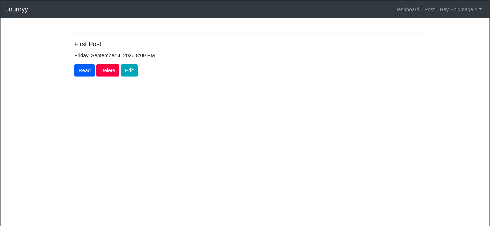
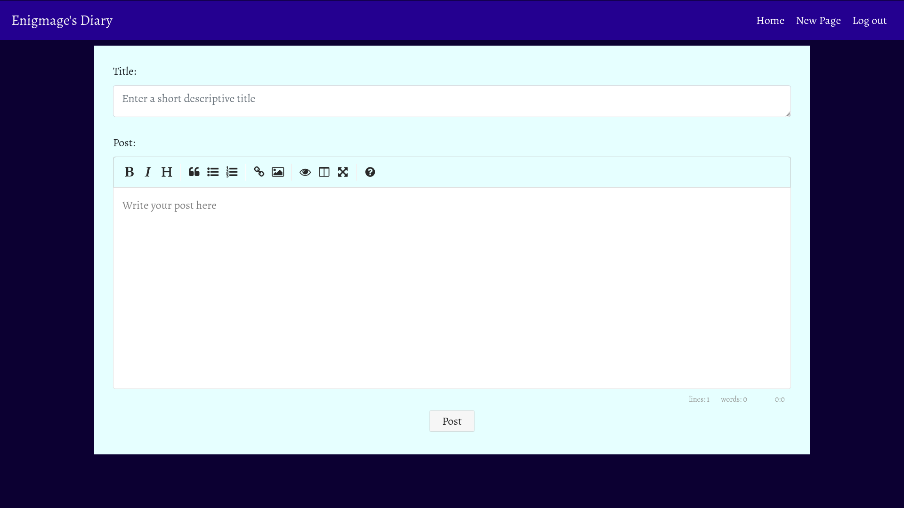
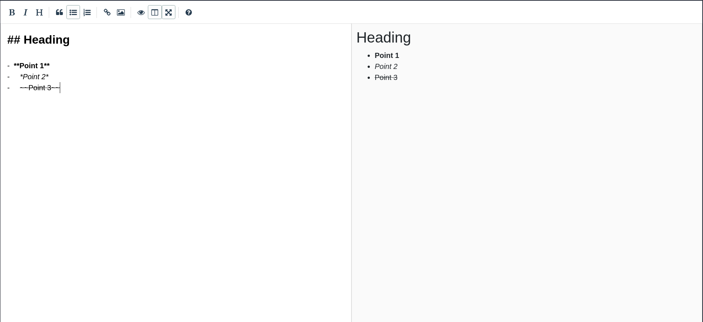

# Journyy

Journal keeping web app with embedded Markdown editor([EasyMDE](https://github.com/Ionaru/easy-markdown-editor)) for composing journals, written in python(flask).

### Dashboard

- Simple Dashboard to keep all your journals in one place. Time of each post is displayed to help keep tracking. This application uses MomentJS to map UTC to localtime, so no matter if you are in a different timezone that the server, you will always be shown your appropriate local time.

### Editor

- Markdown editor for writing.

- Live preview Markdown

## Upcoming Features

* OAuth (to make authentication easier)
* Email Support (for password reset and daily reminder)
* Personalized profile page
* Mood Tracking and frequency charts to track activity

